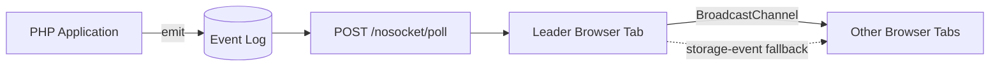

# NoSocket

**Realtime for Shared Hosting.**

[](composer.json)
[](LICENSE)
[](https://github.com/Rokhbin/NoSocket/actions/workflows/ci.yml)

[فارسی](README.fa.md) | English

NoSocket is a framework-agnostic event delivery layer for PHP applications that need near-realtime updates on ordinary shared hosting. It uses short HTTP requests, an indexed event log, adaptive polling, and cross-tab coordination. It does not require WebSockets, SSE workers, Redis, brokers, Node.js, daemons, or persistent processes.

## Why NoSocket?

Shared hosting is a practical home for many PHP applications, but it usually has strict operational boundaries. Applications may be unable to open WebSocket ports, run background workers continuously, install Redis, manage a message broker, keep SSE responses open, or supervise Node.js processes and daemons. Those constraints make many common realtime stacks unavailable or unnecessarily difficult to operate.

Basic polling works almost everywhere, but polling from every open browser tab creates avoidable traffic. NoSocket exists for the space between those options: it provides a small event API and responsive UI updates while remaining compatible with standard PHP request lifecycles.

NoSocket is designed for applications where a delay of a few seconds is acceptable and predictable server load matters more than sub-second delivery.

## Key Features

- Short-lived event log stored in MySQL, MariaDB, PostgreSQL, or SQLite
- Independent revision cursor for each subscribed channel
- Adaptive polling: normal, recently active, and short burst intervals
- Single-tab leader election with Web Locks and a local-storage lease fallback
- Cross-tab event fan-out with `BroadcastChannel` and storage-event fallback
- Signed, scoped channel grants with refresh support
- Retained replay, offline recovery, and explicit retention-gap resync
- Database-backed rate limiting, shared cooldowns, jitter, and smart backoff
- Batched emits, opt-in probabilistic cleanup, diagnostics, and metrics hooks
- Vanilla PHP core with Laravel, Symfony, CodeIgniter 4, and WordPress adapters

## How It Works

1. Your PHP application emits a small event after an authoritative write.
2. NoSocket appends that event to an indexed database table with a configurable TTL.
3. The browser leader tab sends a short `POST /nosocket/poll` request with its latest cursor for each channel.
4. The server returns only newer retained events.
5. The leader tab dispatches events locally and forwards them to follower tabs.
6. If required events have expired, NoSocket emits `nosocket.resync_required` so the application can refresh its snapshot.



When several tabs share the same origin and namespace, only the elected leader polls the server. Other tabs consume the same updates without creating additional poll traffic.

Default cadence:

| State | Poll interval |
| --- | ---: |
| Normal | 30 seconds |
| Recently active user | 10 seconds |
| Events arriving | 2 seconds for 30 seconds |
| HTTP 403 | wait at least 60 seconds |
| HTTP 429 | wait at least 120 seconds |
| HTTP 504 | wait at least 300 seconds |

Repeated failures use exponential backoff capped at five minutes.

## Quick API Example

Emit an event from PHP:

```php
$nosocket->emit('orders', 'order.created', ['id' => 123]);

$nosocket->emitBatch([
    ['channel' => 'orders', 'event' => 'order.updated', 'payload' => ['id' => 123]],
    ['channel' => 'dashboard', 'event' => 'metrics.updated', 'payload' => ['online' => 7]],
]);
```

Subscribe in the browser:

```js
import { createNoSocket } from "/assets/js/nosocket.js";

const NoSocket = createNoSocket({
  endpoint: "/nosocket/poll",
  namespace: `shop:user-${currentUser.id}`,
  tokenProvider: ({ channels }) => fetchToken(channels),
  onResync: ({ channel }) => refreshSnapshot(channel),
});

NoSocket.subscribe("orders");
NoSocket.on("order.created", (order) => console.log(order.id));
NoSocket.start();
```

For the complete browser and PHP APIs, see the [API reference](docs/api.md).

## Use Cases

- Shared hosting and cPanel applications
- Admin dashboards and operational screens
- Notifications and order updates
- Multi-user business systems
- Laravel applications deployed without persistent workers
- Legacy PHP applications that need incremental realtime behavior

NoSocket is intended for UI synchronization. Authoritative writes still go through your application's normal validated routes.

## Packages

| Package | Purpose |
| --- | --- |
| `nosocket/nosocket` | Vanilla PHP core |
| `@nosocket/client` | Browser SDK |
| `nosocket/laravel` | Laravel provider, facade, route, migration |
| `nosocket/symfony` | Symfony controller and service wiring |
| `nosocket/codeigniter4` | CodeIgniter 4 services and controller |
| `packages/wordpress/nosocket` | WordPress plugin |

## Install

```bash
composer require nosocket/nosocket
mysql -u app -p app_db < database/mysql/schema.sql
```

Set `NOSOCKET_DSN`, `NOSOCKET_DB_USER`, `NOSOCKET_DB_PASSWORD`, and a random `NOSOCKET_SECRET` of at least 32 characters. Point a route at [`public/poll.php`](public/poll.php), issue scoped subscription tokens after your application authorizes channels, and load [`assets/js/nosocket.js`](assets/js/nosocket.js).

See [Installation](docs/installation.md), [Architecture](docs/architecture.md), [API](docs/api.md), [Laravel](docs/laravel.md), [WordPress](docs/wordpress.md), [Observability](docs/observability.md), and the [0.2 upgrade guide](docs/upgrade-0.2.md).

## Comparison

| Approach | Operational model | Shared-hosting fit | Typical latency | Best suited for |
| --- | --- | --- | --- | --- |
| NoSocket | Short PHP requests, database event log, one polling tab | Good | 2-30 seconds by state | Dashboards, orders, notifications, appointments |
| WebSockets | Persistent connections and a compatible server process | Often unavailable | Very low | Chat, collaboration, high-frequency updates |
| SSE workers | Long-lived HTTP responses and available worker capacity | Often limited | Low | One-way streams on controlled infrastructure |
| Redis-based realtime stacks | Redis plus workers, queues, or broadcast processes | Usually unavailable | Low | Applications with managed infrastructure |

NoSocket is not a replacement for WebSockets when very low latency is required. It is an operational alternative for environments where persistent infrastructure is unavailable or unjustified.

For managed third-party services and naive polling, see the broader [comparison guide](docs/comparison.md).

## Project Philosophy

- **Simplicity:** use a small event API and a dependency-light PHP core.
- **Standard HTTP:** keep requests short and compatible with ordinary PHP hosting.
- **Framework-agnostic design:** provide a reusable core and keep framework adapters thin.
- **Shared-hosting compatibility:** avoid infrastructure that many low-cost hosting plans cannot run.

## Guarantees And Boundaries

- NoSocket uses short HTTP requests only. It is not a low-latency replacement for WebSockets.
- Under normal browser conditions, tabs sharing an origin and namespace elect one polling leader.
- If browser storage is disabled, cross-tab election cannot be guaranteed and tabs may each poll.
- Replay covers retained events. Retention gaps trigger `nosocket.resync_required`.
- Bearer subscription grants must be delivered over HTTPS and kept short-lived.

## Verify

```bash
composer test
npm ci
npm test
npm run test:e2e
php benchmarks/run.php
```

The CI workflow verifies PHP, SQLite, MySQL, MariaDB, PostgreSQL, adapter fixtures, JavaScript unit tests, and Playwright multi-tab behavior.

## License

MIT. See [LICENSE](LICENSE).
